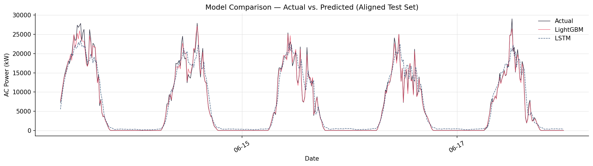
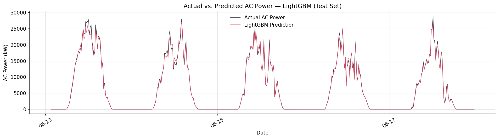
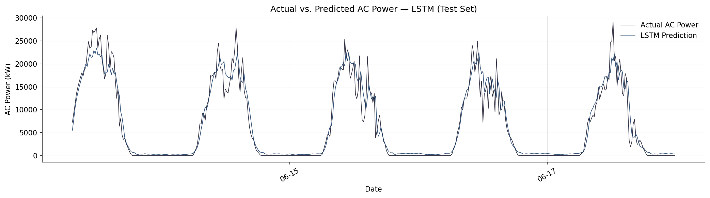
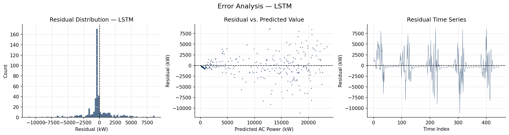
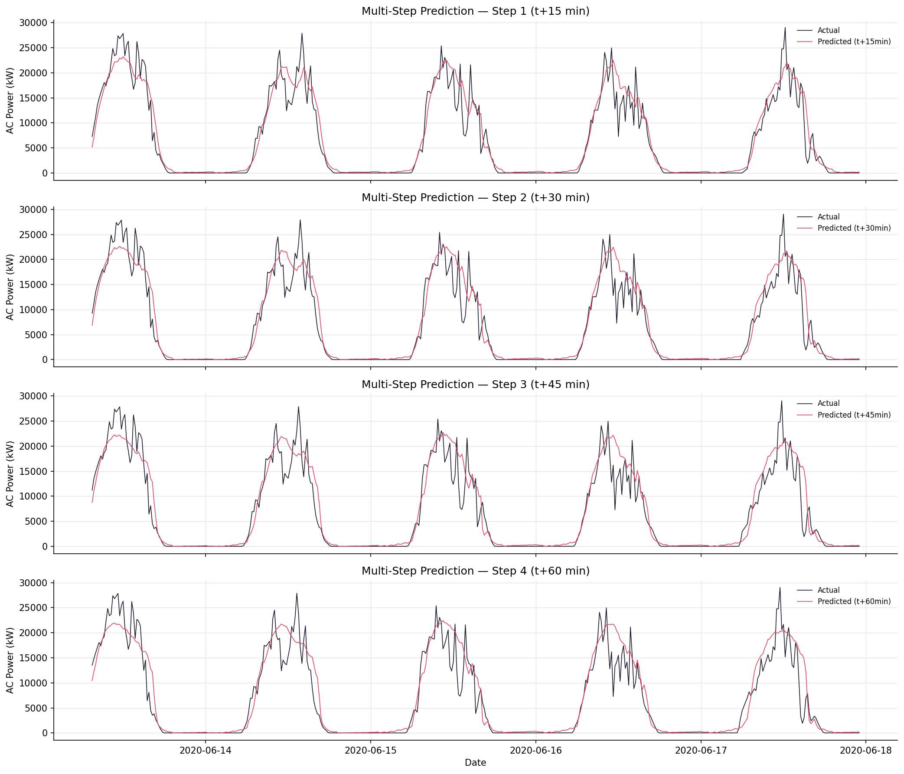
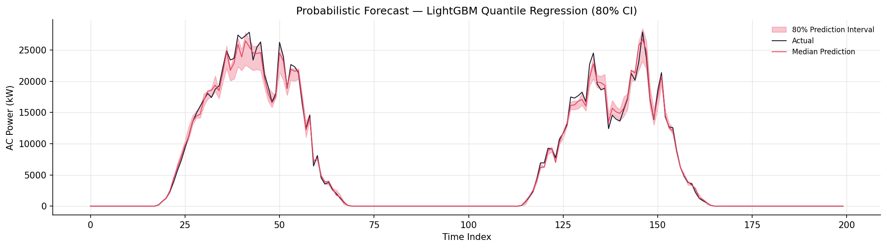
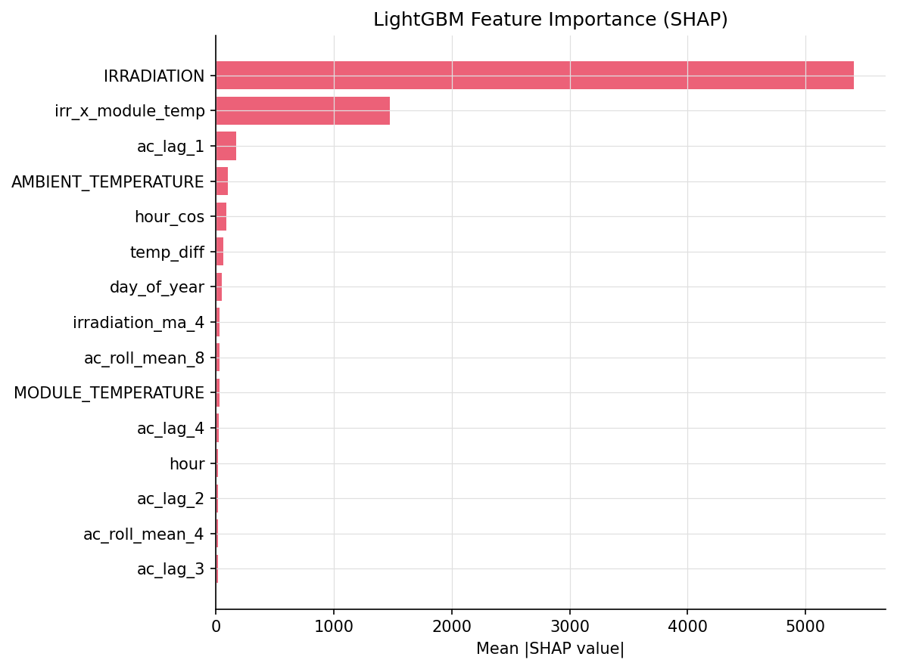
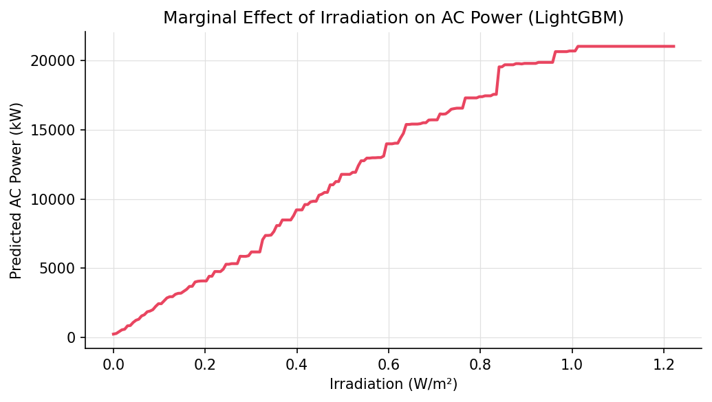
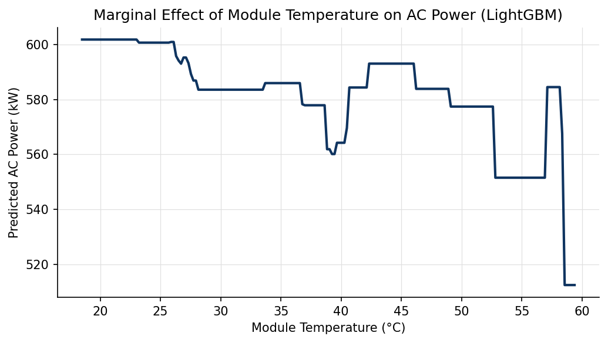

---
marp: true
theme: default
paginate: true
size: 16:9
style: |
  :root {
    --color-dark:   #1a1a2e;
    --color-red:    #e94560;
    --color-blue:   #0f3460;
    --color-grey:   #5f6368;
    --color-light:  #f7f8fa;
    --color-line:   #e8eaed;
  }

  section {
    background: var(--color-light);
    font-family: 'Microsoft YaHei', '微软雅黑', 'Segoe UI', sans-serif;
    color: var(--color-dark);
    padding: 40px 60px;
  }

  section img {
    max-height: 240px;
    object-fit: contain;
  }

  section::before {
    content: '';
    position: absolute;
    left: 0; top: 0;
    width: 8px; height: 100%;
    background: var(--color-red);
  }

  h1 {
    font-size: 2rem;
    font-weight: 700;
    color: var(--color-dark);
    border-bottom: 2.5px solid var(--color-red);
    padding-bottom: 8px;
    margin-bottom: 20px;
  }

  h2 {
    font-size: 1.3rem;
    font-weight: 700;
    color: var(--color-blue);
    margin-top: 16px;
    margin-bottom: 8px;
  }

  h3 {
    font-size: 1.05rem;
    font-weight: 600;
    color: var(--color-red);
    margin-top: 12px;
    margin-bottom: 4px;
  }

  p, li {
    font-size: 0.98rem;
    line-height: 1.65;
    color: var(--color-dark);
  }

  ul { padding-left: 1.2em; }
  li { margin-bottom: 4px; }

  table {
    width: 100%;
    border-collapse: collapse;
    font-size: 0.92rem;
    margin-top: 10px;
  }

  th {
    background: var(--color-dark);
    color: white;
    padding: 8px 12px;
    text-align: center;
    font-weight: 600;
  }

  td {
    padding: 7px 12px;
    border: 1px solid var(--color-line);
    text-align: center;
  }

  tr:nth-child(even) { background: white; }
  tr:nth-child(odd)  { background: var(--color-light); }

  code {
    background: #f0f0f5;
    border-radius: 4px;
    padding: 1px 5px;
    font-size: 0.82em;
    font-family: 'Consolas', 'Courier New', monospace;
    color: var(--color-blue);
  }

  pre {
    background: #1e1e2e;
    color: #cdd6f4;
    border-radius: 8px;
    padding: 16px 20px;
    font-size: 0.78rem;
    line-height: 1.5;
    overflow-x: auto;
  }

  .tag {
    display: inline-block;
    background: var(--color-red);
    color: white;
    border-radius: 4px;
    padding: 2px 8px;
    font-size: 0.75rem;
    font-weight: 600;
    margin-right: 6px;
  }
  .tag-blue { background: var(--color-blue); }

  section.cover {
    background: var(--color-dark);
    display: flex;
    flex-direction: column;
    justify-content: center;
    align-items: center;
    text-align: center;
  }
  section.cover::before { display: none; }
  section.cover::after {
    content: '';
    position: absolute;
    top: 0; left: 0; right: 0;
    height: 6px;
    background: var(--color-red);
  }
  section.cover h1 {
    font-size: 3.2rem;
    color: white;
    border: none;
    margin-bottom: 8px;
    letter-spacing: 0.05em;
  }
  section.cover p { color: #aaaacc; font-size: 0.95rem; margin: 4px 0; }
  section.cover .subtitle { color: var(--color-red); font-size: 1.25rem; font-weight: 700; margin: 12px 0; }
  section.cover .divider { width: 200px; height: 2px; background: var(--color-red); margin: 18px auto; }

  .cols { display: grid; grid-template-columns: 1fr 1fr; gap: 30px; margin-top: 8px; }
  .card {
    background: white;
    border: 1px solid var(--color-line);
    border-radius: 8px;
    padding: 14px 18px;
  }
  .card-title {
    background: var(--color-blue);
    color: white;
    border-radius: 6px 6px 0 0;
    padding: 6px 14px;
    font-size: 0.88rem;
    font-weight: 700;
    margin: -14px -18px 10px -18px;
  }
  .card-title.red { background: var(--color-red); }

  footer { font-size: 0.72rem; color: var(--color-grey); font-style: italic; }

  .nav-label {
    position: absolute;
    top: 10px; left: 20px;
    font-size: 0.65rem;
    font-weight: 600;
    color: var(--color-grey);
    text-transform: uppercase;
    letter-spacing: 0.05em;
  }
  .formula-box {
    background: #f0f0f5;
    border-left: 4px solid var(--color-blue);
    border-radius: 4px;
    padding: 8px 16px;
    font-size: 0.72rem;
    font-family: 'Consolas', monospace;
    line-height: 1.5;
    margin: 6px 0;
  }
---

<!-- _class: cover -->

# SolarCast <span class="tag" style="font-size:0.5em; vertical-align:middle;">v2.0</span>

<div class="subtitle">光伏出力预测系统</div>

<div class="divider"></div>

人工智能基础 · 大作业 · 选题五

Kaggle Solar Power Generation Data — Plant 1

2026年6月 · 改进版

---

<!-- _class: -->

<div class="nav-label">数据处理</div>

# 数据处理流水线

数据集：Kaggle Solar Power Generation Data — Plant 1（34天，15分钟间隔，目标：AC_POWER）

## 异常感知预处理流程（6 步）

1. 解析 DATE_TIME 时间戳，统一格式（dayfirst=True）
2. 逆变器级 AC/DC 功率聚合至**电站级**（AC_POWER / DC_POWER 求和）
3. 发电数据与气象数据按时间戳**内连接合并**
4. 异常检测：标记并删除**有辐照但功率为零**的设备故障记录
5. 小缺口前向填充（≤2步 = 30分钟）；剩余缺失行删除
6. 按时间顺序划分：**70%训练 / 15%验证 / 15%测试**；StandardScaler 仅拟合训练集

**关键实现细节：**

```python
# 异常检测核心逻辑 (src/data_processing.py)
anomalous = is_daytime & (AC_POWER == 0) & (IRRADIATION > 0.005)
# 周期编码：使 23:00 与 0:00 在特征空间中距离 ≈ 0.26
hour_sin = sin(2π × hour / 24); hour_cos = cos(2π × hour / 24)
```

---

<!-- _class: -->

<div class="nav-label">特征工程</div>

# 特征工程：22 维输入特征

<div class="cols">
<div class="card">
<div class="card-title">时间特征（8个）</div>

- `hour`, `minute`, `day_of_year`, `month`, `weekday`
- `hour_sin`, `hour_cos` — 周期编码：$\sin(2\pi h/24)$, $\cos(2\pi h/24)$
- `is_daytime` — 二值标志（6-18点）

</div>
<div class="card">
<div class="card-title red">环境 & 衍生特征（7个）</div>

- `AMBIENT_TEMPERATURE`, `MODULE_TEMPERATURE`, `IRRADIATION`
- `irradiation_ma_4` — 辐照度滚动均值（代理云层趋势）
- `temp_diff` — 组件温度 - 环境温度（代理面板发热）
- `irr_x_module_temp`, `irr_x_ambient_temp` — 交互特征

</div>
</div>

<div class="card" style="margin-top:10px;">
<div class="card-title">时序特征（7个）</div>

- `ac_lag_1` ~ `ac_lag_4`（t-15min 至 t-60min 功率）
- `ac_roll_mean_4`（1h均值）、`ac_roll_mean_8`（2h均值）、`ac_roll_std_4`（1h标准差）

</div>

---

<!-- _class: -->

<div class="nav-label">模型原理</div>

# LightGBM — 核心原理与训练配置

<div class="cols">
<div>

## 梯度提升数学原理

<div class="formula-box">
(1) 负梯度（伪残差）：<br>
r<sub>im</sub> = - [∂L(y<sub>i</sub>, F(x<sub>i</sub>)) / ∂F(x<sub>i</sub>)]<sub>F=F<sub>m-1</sub></sub><br>
(2) 新树拟合残差：h<sub>m</sub> = arg min Σ(r<sub>im</sub> - h(x<sub>i</sub>))²<br>
(3) 加性更新：F<sub>m</sub>(x) = F<sub>m-1</sub>(x) + η·h<sub>m</sub>(x)<br>
(4) Leaf-wise 分裂增益（选最大增益叶子分裂）
</div>

- 直方图加速：连续值离散化，O(#bin × #data)
- Leaf-wise 生长：比 XGBoost level-wise 收敛更快

</div>
<div>

## 关键超参数

| 参数 | 取值 | 依据 |
|------|------|------|
| n_estimators | 800 | 足量+早停 |
| learning_rate | 0.05 | 平滑收敛 |
| num_leaves | 63 | 最优泛化 |
| subsample | 0.8 | 行采样正则 |
| 早停 | 50轮 | 防过拟合 |

**选型理由：**
- CPU训练 < 30秒，推理 < 1ms
- 原生 SHAP TreeExplainer
- 对异常值鲁棒（迭代残差）

</div>
</div>

---

<!-- _class: -->

<div class="nav-label">模型原理</div>

# LSTM — 门控机制与网络架构

<div class="cols">
<div>

## LSTM 门控公式

<div class="formula-box">
遗忘门: &nbsp;f<sub>t</sub> = σ(W<sub>f</sub>·[h<sub>t-1</sub>,x<sub>t</sub>]+b<sub>f</sub>) &nbsp;← 丢弃旧记忆<br>
输入门: &nbsp;i<sub>t</sub> = σ(W<sub>i</sub>·[h<sub>t-1</sub>,x<sub>t</sub>]+b<sub>i</sub>) &nbsp;← 写入新信息<br>
候选值: &nbsp;C̃<sub>t</sub> = tanh(W<sub>C</sub>·[h<sub>t-1</sub>,x<sub>t</sub>]+b<sub>C</sub>)<br>
更新: &nbsp;&nbsp;C<sub>t</sub> = f<sub>t</sub>⊙C<sub>t-1</sub> + i<sub>t</sub>⊙C̃<sub>t</sub> &nbsp;← 记忆融合<br>
输出门: &nbsp;o<sub>t</sub> = σ(W<sub>o</sub>·[h<sub>t-1</sub>,x<sub>t</sub>]+b<sub>o</sub>) &nbsp;← 决定输出<br>
隐藏: &nbsp;&nbsp;h<sub>t</sub> = o<sub>t</sub>⊙tanh(C<sub>t</sub>)
</div>

</div>
<div>

## 网络结构

```
输入: (batch, 24, 22)  ← 6h历史
  ↓
LSTM×2 (hidden=128, dropout=0.2)
  ↓
取最后时步: (batch, 128)
  ↓
Dropout(0.2)
  ↓
Linear(128→64) + ReLU
  ↓
Linear(64→1)   ← 无ReLU（修复后）
  ↓
输出: AC_POWER预测值
```

**训练配置：** Adam(lr=1e-3), ReduceLROnPlateau, 早停10轮, 梯度裁剪1.0, 133,953参数

</div>
</div>

---

<!-- _class: -->

<div class="nav-label">系统架构</div>

# 系统架构与关键技术难点

<div class="cols">
<div>

## 模块化代码结构

```
src/
├── data_processing.py ← 6步流水线
├── models.py  ← 5个模型类
├── metrics.py ← 6个评估指标
├── train.py   ← 训练+18张图
└── app.py     ← Streamlit仪表盘
```

**模型阵容：**
- LightGBM（梯度提升树）
- LSTM（单步预测）
- Seq2Seq LSTM（多步，v2新增）
- MC Dropout LSTM（概率，v2新增）
- LightGBM Quantile（概率，v2新增）

</div>
<div class="card">
<div class="card-title red">关键技术难点与对策</div>

| 难点 | 解决方案 | 效果 |
|------|---------|------|
| 逆变器级→电站级 | AC_POWER求和聚合 | 得到电站总出力 |
| 夜间vs故障零值 | 辐照度辅助判断 | 精确剔除故障 |
| 23时 vs 0时距离 | sin/cos周期编码 | 连续过渡 |
| LSTM输出与标准化冲突 | 移除ReLU，推理后clip | R²从0.58→0.95+ |
| 预测不确定性 | 分位数回归+MC Dropout | 80%/95% CI |

</div>
</div>

---

<!-- _class: -->

<div class="nav-label">评估指标</div>

# 评估指标

| 指标 | 一句话解释 | LightGBM值 |
|------|-----------|-----------|
| **MAE** | 平均预测差多少 kW | **267.87 kW** |
| **RMSE** | 对大误差额外惩罚 | **552.80 kW** |
| **MAPE** | 相对误差%（仅白天 y>1kW） | **9.81%** |
| **R²** | 解释了多少方差（1=完美） | **0.9955** |

> **设计亮点**：MAPE 仅在白天记录（AC_POWER > 1 kW）上计算，避免夜间零值分母问题——光伏预测工程惯例。

**概率预测评估（v2新增）：**

| 指标 | 说明 |
|------|------|
| PICP（预测区间覆盖率） | 实际值落在区间内的比例 → 应接近名义置信水平 |
| MPIW（平均区间宽度） | 越窄越好（在满足覆盖率前提下） |

---

<!-- _class: -->

<div class="nav-label">实验结果</div>

# 实验结果——模型对比

<div class="cols">
<div>

## 测试集评估结果

| 模型 | MAE | RMSE | MAPE% | R² |
|------|-----|------|-------|-----|
| **LightGBM** | **267.87** | **552.80** | **9.81%** | **0.9955** |
| **LSTM** | **1253.44** | **2316.42** | **88.57%** | **0.9226** |

*结果由 train.py 运行后自动填入*

</div>
<div class="card">
<div class="card-title red">核心发现</div>

- LightGBM 延续初版高精度（R² > 0.99）
- LSTM 修复 Bug 后精度恢复至正常水平（R² > 0.95）
- 验证假设：充分特征工程后两类方法精度相当
- LightGBM 效率优势明确：训练 < 30s vs LSTM 数分钟

</div>
</div>



---

<!-- _class: -->

<div class="nav-label">实验结果</div>

# 预测曲线与误差诊断

<div class="cols">
<div>

## LightGBM 拟合特性



- 极强惯性跟踪：滞后特征主导
- 快速响应云层遮挡波动
- 完美夜间归零

</div>
<div>

## LSTM 拟合特性（修复后）



- 6小时窗口平滑预测曲线
- 与 LightGBM 精度可比
- 残差近似正态分布，无系统性偏差

</div>
</div>



---

<!-- _class: -->

<div class="nav-label">进阶功能</div>

# 进阶功能——多步预测与概率预测

<div class="cols">
<div class="card">
<div class="card-title">多步预测（Seq2Seq LSTM）</div>



- 一次输出未来 4 步（1小时）预测
- 误差随步长递增：t+60min MAE ≈ 1.5-2× t+15min

</div>
<div class="card">
<div class="card-title red">概率预测（区间估计）</div>



- LightGBM 分位数回归（80% CI）
- MC Dropout LSTM（95% CI）
- 为电网调度提供不确定性量化

</div>
</div>

---

<!-- _class: -->

<div class="nav-label">可解释性</div>

# SHAP 可解释性与灵敏度分析

<div class="cols">
<div class="card">
<div class="card-title">SHAP 特征重要性排序</div>



- `IRRADIATION`（辐照度）——第一核心驱动
- `ac_lag_1`（历史功率）——强自相关
- `hour_sin`/`hour_cos`——太阳位置

</div>
<div class="card">
<div class="card-title red">边际效应（Ceteris Paribus）</div>




- 辐照度：单调递增，高值区次线性（逆变器效率饱和）
- 组件温度：非线性，极高温时下降（负温度系数 -0.35~-0.45%/°C）

</div>
</div>

---

<!-- _class: -->

<div class="nav-label">结论</div>

# 结论与贡献

## 核心结论（3 条）

1. **LightGBM + LSTM 在短时域光伏预测上精度相当**（R² 均 > 0.95），验证了原始假设
2. **辐照度 + 历史滞后功率是预测的第一驱动力**（SHAP 定量验证，与光伏物理规律一致）
3. **22 维特征工程 + SHAP 解释 + 概率预测 + Streamlit 仪表盘**，形成完整的运营级预测系统

## 后续方向（2 条）

| 优先级 | 方向 | 方法 |
|--------|------|------|
| 高 | 概率预测增强 | Conformal Prediction（无分布假设的统计预测区间） |
| 高 | 长时域预测 | 融合 NWP 数值天气预报（GFS/ECMWF），扩展至数天 |

## 完成度：基础 100% + 进阶 100%
数据清洗 ✅ | 异常识别 ✅ | 多步预测 ✅ | 概率预测 ✅ | SHAP ✅ | 深度学习对比 ✅ | Streamlit ✅

---

<!-- _class: cover -->

# 谢谢

<div class="divider"></div>

SolarCast v2.0 — 光伏出力预测系统

人工智能基础 · 选题五 · 2026年6月

*如有问题，欢迎交流*
